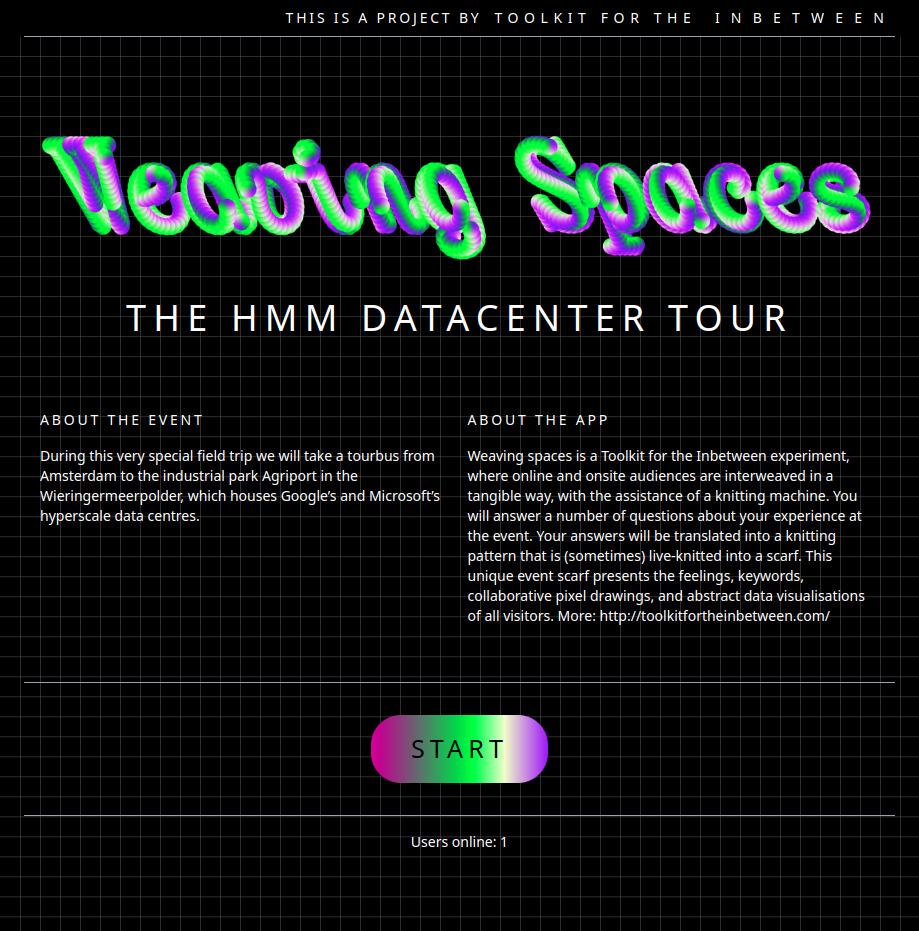
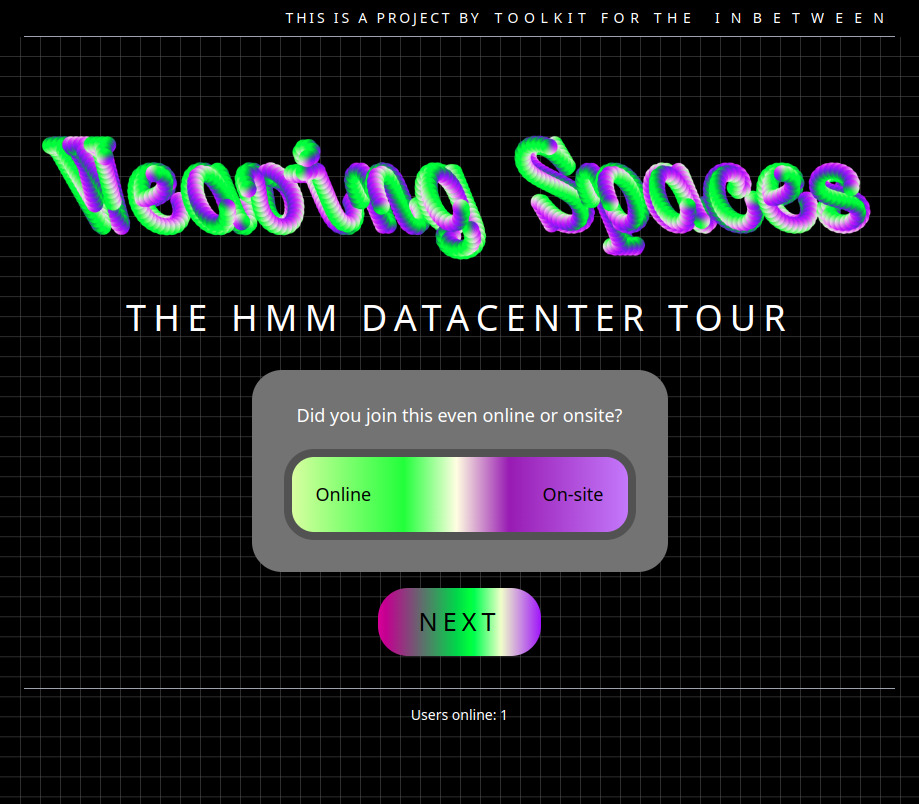
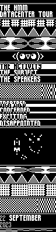
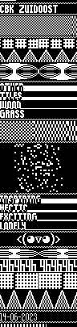
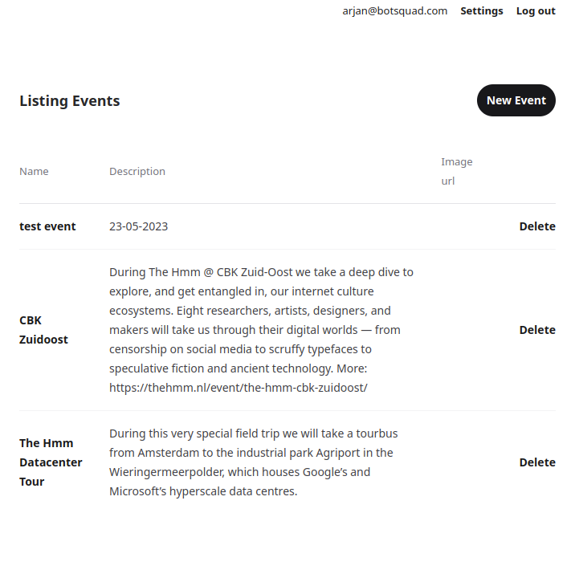

# KnitMaker

An interface for creating knittings as feedback on physical/virtual events
(meetups, exhibitions, symposia, etc).

## Event interface

Visitors can participate by browsing to an event's URL, and are greeted with a
welcome page:

Next, they are presented a series of questions to be answered:

Finally, all of these questions help create a knitting pattern that looks similar to one of the following:

## Admin interface

Events can be created and edited on the admin interface:

> Users that sign up need to be made administrator manually by setting the
> `is_admin` flag in the database for the user.

On the admin pages you can edit all aspects of each event, including creating
questions and their corresponding visualizations.
